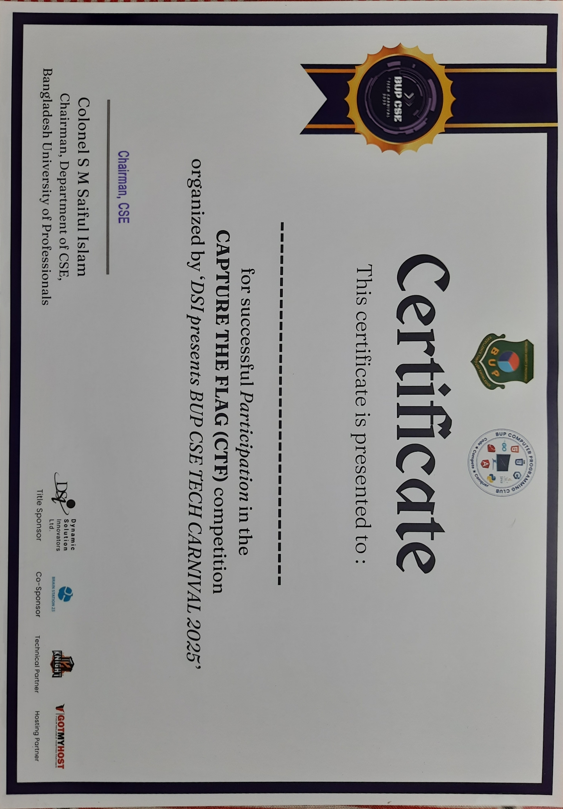

# BUP CSE Tech Carnival 2025 - Capture The Flag (CTF)

## Overview
Participated in the **Capture The Flag (CTF)** competition at **BUP CSE Tech Carnival 2025** as part of team **MamaDecryptMar**. This competition was a significant learning experience, as our team successfully competed against 120 teams despite having no prior CTF background.

## Event Details
| Category | Details |
| --- | --- |
| Event | BUP CSE Tech Carnival 2025 |
| Segment | Capture The Flag (CTF) |
| Organizer | Department of CSE, Bangladesh University of Professionals (BUP) |
| Venue | BUP Campus, Dhaka |
| Date | September 25, 2025 |
| Team | MamaDecryptMar |
| Team Size | 4 members |

## Competition Format
- **Two rounds:** Online preliminary and onsite final.
- **Preliminary Round:** ~120 university teams participated from across Bangladesh.
- **Final Round:** Top 40 teams qualified for the onsite finals.

## Results
- Ranked **11th** globally in the preliminary round.
- Secured **14th Position** in the onsite final round.
- Successfully competed as one of the top finalists in only our second-ever CTF competition.

## Attachments
- [Certificate of Participation](BUP_CSE_Tech_Carnival_CTF_2025_Certificate.jpg)

