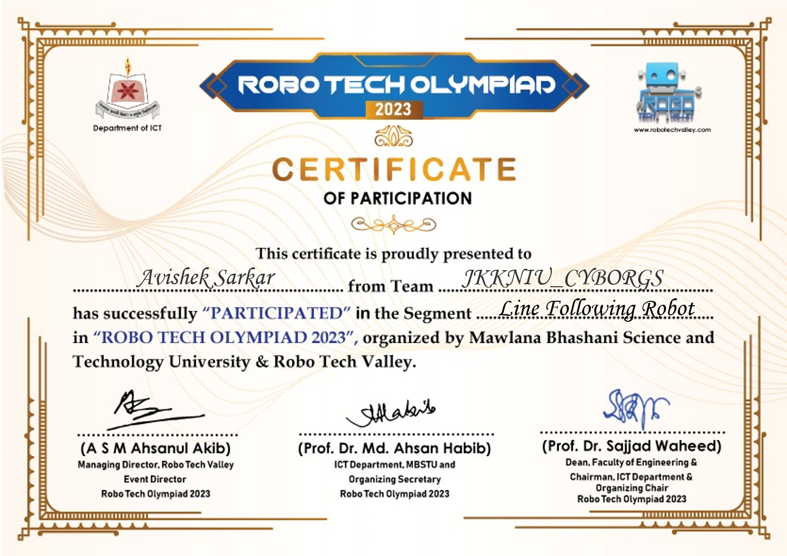

# Robo Tech Olympiad 2023 - Line Following Robot Competition

## Overview
Participated in the **Line Following Robot (LFR)** segment at **Robo Tech Olympiad 2023** as part of the team **JKKNIU_CYBORGS**. This was our first LFR contest experience.

## Event Details
| Category | Details |
| --- | --- |
| Event | Robo Tech Olympiad 2023 |
| Segment | Line Following Robot (LFR) |
| Organizer | Robo Tech Valley |
| Venue | Mawlana Bhashani Science and Technology University (MBSTU) |
| Date | February 2023 |
| Team | JKKNIU_CYBORGS |
| Team Size | 5 members |

## Competition Format
- Two rounds: preliminary and final.
- 18 teams participated in the preliminary round.
- 7 teams qualified for the final round.

## Results
- Qualified for the final round as the 2nd fastest team in preliminaries.
- Competed in the final round among the top 7 finalist teams.

## Attachments
- [Certificate of Participation](RoboTech_Olympiad_LFR_2023_Certificate.png)

