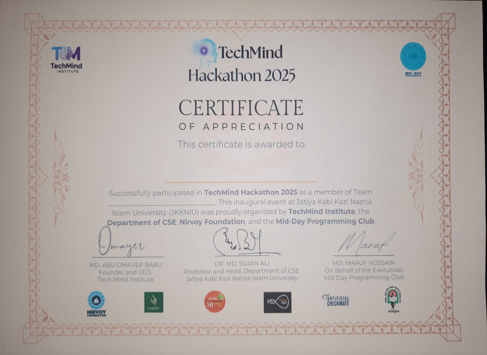

# TechMind Hackathon 2025 - Project MealMate

## Overview
Secured **4th Place** at the **TechMind Hackathon 2025** out of 25 participating teams with project **MealMate**. The project addresses the daily challenge students face in finding and comparing affordable meal options by providing a platform for restaurant menus and a marketplace for homemade foods.

## Event Details
| Category | Details |
| --- | --- |
| Event | TechMind Hackathon 2025 |
| Segment | Hackathon |
| Organizers | TechMind Institute, Dept. of CSE (JKKNIU) |
| Venue | Jatiya Kabi Kazi Nazrul Islam University (JKKNIU) |
| Date | September 6, 2025 |
| Team Size | 2 members |
| Project | MealMate |
| Position | 4th Place |

## Key Features
- Multi-role System: Secure authentication for students, hotel owners, and admins.
- Dynamic Content: Daily menus with automated expiry, reviews, and image support.
- Marketplace: Seamless buying and selling of homemade food items.
- Robust Security: Implemented password hashing, CSRF protection, and input validation.
- Real-time Updates: Integration with Socket.IO for live interactions.

## Tech Stack
- Backend: Flask, Flask-SQLAlchemy, Flask-Migrate, Flask-Bcrypt, Flask-SocketIO
- Frontend: Jinja2, CSS3, Vanilla JavaScript
- Database: SQLite
- Tools: python-dotenv, Flask-CORS, SQLAlchemy ORM

## Results & Media
- Position: **4th Place** out of 25 teams
- GitHub Repository: [MealMate](https://github.com/avishek-sarkar/MealMate)

## Attachments
- [Certificate of Appreciation](TechMind_Hackathon_JKKNIU_2025_Certificate.jpg)

