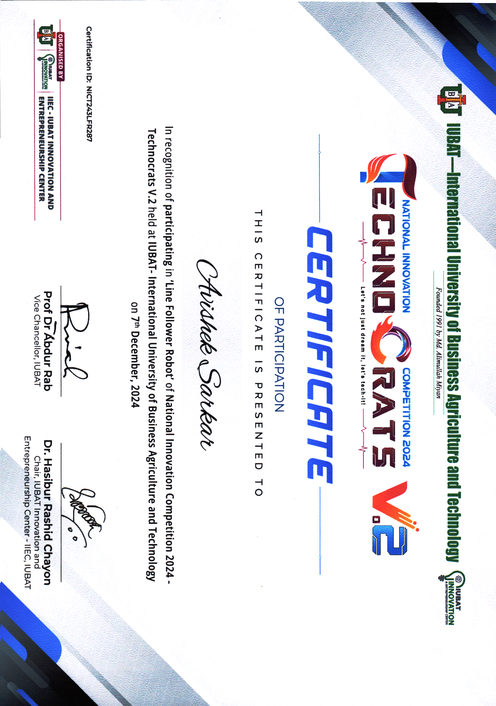

# National Innovation Competition 2024 - TechnoCrats V.2

## Overview
Participated in the **Line Follower Robot (LFR)** segment of the **National Innovation Competition 2024 - Technocrats V.2**. This event was an enriching experience that provided valuable insights into robotics and competitive technical environments, fostering teamwork and professional growth.

## Event Summary
| Category | Details |
| --- | --- |
| Event | National Innovation Competition 2024 - TechnoCrats V.2 |
| Segment | Line Follower Robot (LFR) |
| Organizer | IIEC - IUBAT Innovation and Entrepreneurship Center |
| Venue | International University of Business Agriculture and Technology (IUBAT) |
| Date | December 7, 2024 |
| Team Size | 4 members |
| Certification ID | NICT243LFR287 |

## Key Highlights
- Engaged in a highly competitive LFR segment alongside dedicated teammates.
- Gained hands-on experience in real-time robot optimization and technical problem-solving.
- Strengthened teamwork and collaboration skills through intensive preparation and participation.

## Attachments
- [Certificate of Participation](TechnoCrats_V.2_LFR_2024_Certificate.jpg)

